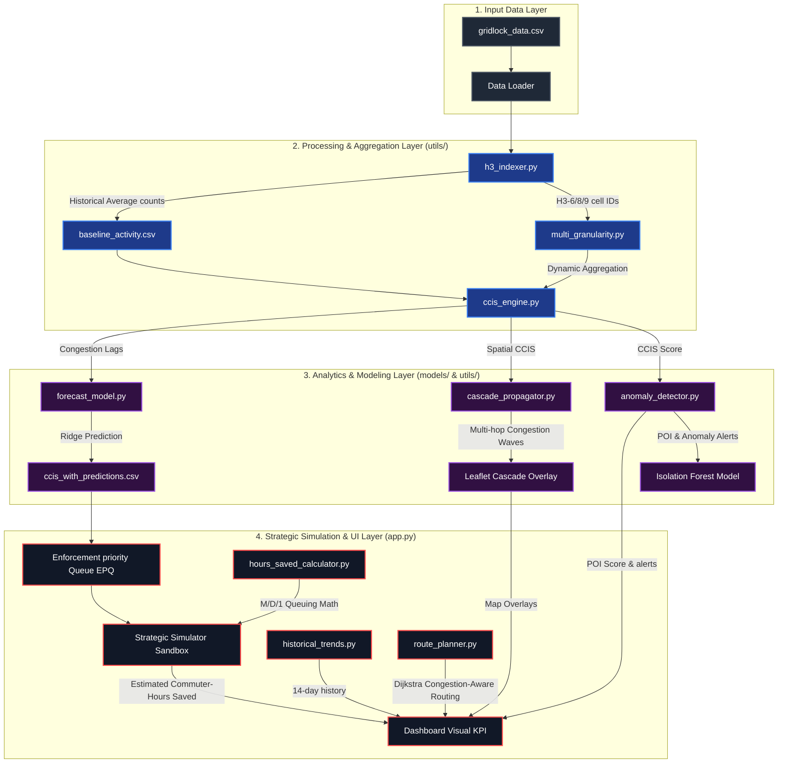

# GridLock Zero - Technical Architecture Diagram & Specifications

This document outlines the system architecture, processing pipelines, and data flow layers for GridLock Zero, built for the Flipkart GridLock Hackathon.

---

## 🗺️ System Architecture Diagram

---

## 🛠️ Module Specifications

### 1. Data Aggregation & Multi-Granularity (`utils/multi_granularity.py`)
- Dynamic spatial binning of lat/lon coordinates using the H3 Hexagonal indexing system.
- Converts coordinates dynamically into three user-selectable zoom scales:
  - **Resolution 6 (City View):** Hexagonal spacing ~3.2km (strategic planning).
  - **Resolution 8 (Zone View):** Hexagonal spacing ~460m (patrol supervisor bounds).
  - **Resolution 9 (Street View):** Hexagonal spacing ~100m (tactical enforcement nodes).

### 2. Isolation Forest Anomaly Detection (`utils/anomaly_detector.py`)
- Identifies unusual traffic events relative to baseline day-of-week and hour traffic profiles.
- Unsupervised anomaly model:
  - **Contamination level:** 10%.
  - **Features:** `violation_count`, `speed_drop`, `ccis`, and `baseline_deviation`.
  - **POI score formula:** $	ext{POI} = 	ext{clip}(	ext{CCIS} 	imes 0.6 + 	ext{anomaly\_score\_normalized} 	imes 4.0, 0, 10)$.

### 3. Cascade Propagation Spillover Model (`models/cascade_propagator.py`)
- Traces multi-hop spillover of gridlock cells outward into the surrounding street network.
- Computes decay rings dynamically:
  $$	ext{Propagated CCIS}_k = 	ext{Base CCIS} 	imes lpha^k$$
- Simulates network bottlenecks and overlays spillovers as purple rings.

### 4. M/D/1 Commuter Delay Calculator (`models/hours_saved_calculator.py`)
- Models traffic delay bottlenecks using deterministic service rates ($\mu$) and Poisson vehicle arrival rates ($\lambda$).
- Exponential capacity decay degradation handles growing queues:
  $$\mu = \mu_{	ext{nominal}} 	imes \left(0.2 + 0.8 	imes e^{-0.002 	imes 	ext{violations}}
ight)$$
- Evaluates deployment impact by tracking delay variations.

---

## 💾 Data Flow Schemas

### 1. CCIS Scores (`ccis_scores.csv`)
| Column | Type | Description |
| :--- | :--- | :--- |
| `h3_cell` | String | H3 index representation of the hexagon spatial cell |
| `hour` | Integer | Hour of day (0 - 23) |
| `violation_count` | Integer | Active illegal parking violation count |
| `lat` / `lon` | Float | Centroid latitude / longitude of the spatial node |
| `ccis` | Float | Causal Congestion Impact Score |
| `day_of_week` | Integer | Day index (0 = Monday, 6 = Sunday) |

### 2. Historical Trends (`historical_trends.py`)
- Standardizes dynamic date mapping to the H3 cell's average daily profile.
- Restructures baseline distributions to simulate visual chronological trends.
